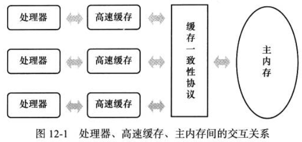
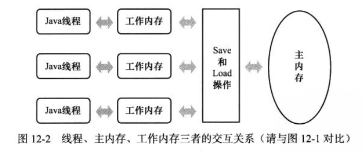

# JVM知识点合集

## 垃圾收集相关

### 垃圾回收时如何判断一个对象是垃圾，可以被回收。

- 引用计数。引用技术说的是垃圾回收器会记录对象被引用的次数。如果某个对象的计数为0,则这个对象可以被回收。引用计数算法比较简单，但是不能解决循环引用的问题。比如A引用B，B再引用A，那么基于这个算法两个对象永远不会被回收。

- 根搜索算法。根搜索算法是以GC Roots为起点进行搜索，当一个对象到GC Root没有任何引用的时候，那么这个对象可以被回收。

可以作为GC Roots的对象：虚拟机栈（栈帧中的本地变量表）中引用的对象；方法区中的类静态属性引用的对象；方法区中的常量引用的对象；本地方法栈中JNI（Native方法）引用的对象。

### Java中四种引用类型

- 强引用：只要引用还在，永远不会回收该对象。

- 软引用：只要内存够用软引用就可以正常被引用，但是当内存不够，要发生OOM之前，这些对象会被回收，如果内存还是不够，则引发OOM。通常一些基于内存的缓存会使用软引用。

- 弱引用：弱引用是比软引用更弱的一个引用。在下一次垃圾回收之前，弱引用的对象就会被回收。

- 虚引用：虚引用的唯一作用就是垃圾回收时收到一个通知。它不会影响垃圾回收。

### Java内存区域划分

- 程序计数器：程序计数器是一块比较小的内存空间，它的作用是当前线程所执行的字节码的行号指示器。在JVM里字节码解释器就是通过改变这个计数器来选取下一条需要执行的字节码指令，比如，分支，循环，跳转，异常处理等都是通过计数器来完成。

Java虚拟机的多线程是通过线程轮流切换并分配处理器执行时间的方式实现的，在任何一个时刻一个处理器只会执行一个线程中的指令。因此不同的线程要享有自己的程序计数器。

- 栈：栈是每个线程私有的空间。一个完整的方法调用，代表了一次入栈出栈过程。每个方法调用的时候都会创建一个栈帧，用于存储局部变量表（包括一些计算的中间变量），操作数栈，动态链接，方法返回地址(returnAddress)等这些信息。一个局部变量可以保存一个类型为 boolean、byte、char、short、float、reference和 returnAddress 的数据,两个局部变量可以保存一个类型为 long 和 double 的数据。

- 堆：堆空间的主要作用就是存放对象实例。堆是所有Java线程共享的区域，而且是垃圾回收器工作的主要区域。一般堆被分成了不同的区域：新生代（Eden，From Survior，to Survior），老年代。

- 方法区：方法区也是各个线程共享的区域，这个区域主要存储：加载的类信息，常量，静态变量，及时编译器编译后的代码等数据。这个区域也会进行GC，主要是回收常量池和对类型卸载, 不过通常回收的效果不佳。

- 运行时常量池：该区域是方法区的一部分。Class文件中除了类的版本，方法，字段接口等描述信息外，还有一项信息是常量池，用于存放编译期生成的各种字面量和符号引用，这部分内容将在类加载后放到运行时常量池。(每一个运行时常量池都分配在 Java 虚拟机的方法区之中,在类和接口被加载到虚拟机后,对应的运行时常量池就被创建出来。)

- 本地方法栈：本地方法栈类似于虚拟机栈，但是本地方法栈是为Native方法是使用的。

### 垃圾收集算法

- 标记清除：标记清除算法分为两个阶段，标记和清除。标记阶段是找到哪些对象需要被回收，清除阶段把这些对象回收掉。

这种算法有一个非常显著的弊端，清除完成后会造成内存碎片。导致分配一些大对象的时候引再次引发GC或者分配失败（OOM）。

- 标记整理：和标记清除算法类似，但是在清楚垃圾之前先把可用对象移向内存一段，然后清理掉边界以外的对象。

- 复制算法：复制算法把内存分成两块，每次只使用其中的一块。每次垃圾回收把存活的对象移动到另外一个内存空间。这样交替执行。

复制算法的弊端是，空间浪费严重，每次实际可用的内存只有总内存大小的一半。

- 分代收集：垃圾收集的过程中绝大多数新生对象都会被回收，只有少部分对象能够存活下来。而且年龄越大的对象越趋于稳定。基于这个经验发明了分代收集算法。整个内存空间会被分成：新生代和老年代。根据其不同的对象特性分别制定垃圾回收策略。新生代一般使用复制算法，老年代可以选择使用mark-sweep或者mark-compact。

HotSpot把新生代分成了三块（Eden，From Survivor，To Survivor）。Eden和（单个）Survivor的大小比例是8：1。整个区域可以利用90%的空间。当这个区域进行Minor GC的时候，Eden区存活的对象和当前使用的Survivor中存活的对象都会移动到另外一个Survivor中。这个过程中会有一些意外情况：Survivor空间可能不够用。遇到这种情况JVM中有一种空间担保机制，把这些对象都移动到老年代。

### 垃圾收集器

垃圾收集算法按照其执行的内存区域，可以分为年轻代垃圾收集器，包括：Serial，ParNew，Parallel Scavenge；可以在老年代工作的垃圾收集器：Serial Old，CMS，Parallel Old。G1收集器把内存分成了大小相等的好多块，因此不存在我们所理解意义上的Young，Old
区了。

Serial/Serial Old：

ParNew：

Parallel Scavenge：
Parallel是吞吐量优先的收集器，通过设置-XX:MaxGCPauseMillis最大gc停顿时间，-XX:GCTimeRatio gc时间和程序事件比率，来调整gc的事件。

Serial Old:

Parallel Old:

CMS:

垃圾收集线程数：（cpus + 3） / 4

G1：

### JVM的对象分配策略

- 对象优先分配在Eden区：
- 大对象分配到老年代：大对象指的是需要大量连续内存空间的对象。这种对象会直接分配的老年代。目的是为了减少在年轻代的大量的拷贝。JVM提供了一个参数设置大对象的阀值：-XX:PretenureSizeThreshold(这个参数只对Serial和Parnew两个收集器有效)
- 长期存活的对象进入老年代
- 空间分配担保：每次Minor GC的时候都会检查之前晋升到老年代的平均大小是否大于当前老年代当前剩余空间，如果大于则执行一次Full GC。如果小于则查看HandlePromotionFailure设置是否允许空间担保失败，如果允许则只进行Minor GC，如果不允许则执行一次Full GC。
- 动态年龄判断：如果Survivor中相同年龄的对象达到了空间的一半及以上，那么>=该对象年龄的对象提前晋升到老年代。

### JVM 类加载

类的生命周期及各个阶段的工作。JVM必须按照图中的规定的流程工作。比如初始化一个类之前一定要经过类的装载验证准备解析等工作

#### 装载

类装载的过程：

- 通过类的全限定名获取类的二进制字节流
- 转换成方法区的运行时结构
- 在堆空间中创建一个Class对象，作为方法区这个类的访问入口。

#### 验证

验证的主要工作是验证class文件的合法性。通常这一步是非常麻烦的，如果想要关闭这一步可以通过-Xverify:none跳过。

- 文件格式验证。（是否以0xCAFEBABE开头，主次版本号是否能够）
- 元数据验证。（是否有父类，是否继承了不能被继承的类，是否实现了父类和接口的所有方法，字段和方法是否和父类矛盾。通常这些问题在编码的时候都能够通过编译找到问题）。
- 分析程序语义的合法性。
- 符号引用验证。主要是对自身以外的信息进行匹配校验。（比如字段，类，方法的可见性是否可以被当前类访问）。

#### 准备

准备阶段是为类变量分配内存，并设置类变量的初始值。这个阶段不会对变量复制，类变量的赋值是放在类构造器<clinit>()方法中，这是在初始化阶段作的。Final字段的赋值是在编译阶段确定的。

#### 解析

解析阶段是虚拟机将常量池中的符号引用改为直接引用。这个过程会递归的把对其它类的引用load到jvm中。符号引用只是一个标识，很可能符号引用的目标还未load入虚拟机。直接引用可以是直接指向目标的指针，相对偏移量，或一个定位到目标的句柄。（我理解应该是这个过程应该是链接到jvm内存中A.b的内存地址，比如常量池中的一个句柄）
a)类和接口解析。如果引用了其他的类，则直接走老一套的类加载阶段。
b)字段引用。当前类搜索 -> 父类和接口 如果可以找到则返回，如果到了Object都没有找到则NoSuchFieldException。
c)类和接口方法查找。

#### 初始化

初始化阶段是执行<clinit>()的过程。<clinit>()是所有类变量复制和static{}合并产生的，其顺序取决于code源文件中的顺序。

在调用当前类的<clinit>()之前，jvm会保证先去执行父类的<clinit>()，所以jvm中第一个执行的<clinit>()一定是Object的。

如果类或接口中没有静态语句块或没有变量的复制操作，那么编译器可以不生成<clinit>()方法。

执行接口的<clinit>()的时不用先执行父接口的<clinit>()方法，只有当调用其变量是才调用。

虚拟机会保证在并发环境下<clinit>()的正确执行。

#### 触发一个类进行初始化的几个条件：

- JVM遇到了以下指令：new，getstatic，putstatic，invokestatic。在实际应用场景中对应：new一个class，访问/设置一个对象的静态变量，调用一个类的静态方法。
- 通过反射实例化一个类。
- 初始化类的时候如果发现其父类没有被初始化。
- 虚拟机启动是包含入口函数的那个类。
- 调用java.lang.invoke.MethodHandle返回的结果是REF_getStatic，REF_putStatic，REF_invokeStatic，REF_newInvokeSpecial。且对应的类没有经过初始化，则对其进行初始化。

### 类加载器

类加载器是加载Class的工具类，ClassLoader有两类：Extension ClassLoader，BootStrap ClassLoader，Application ClassLoader。BootStrap是JVM的一部分，由C++实现。User ClassLoader是由Java语言实现，并继承自ClassLoader。

### Java内存模型

Java内存模型是为了屏蔽底层内存访问，为程序提供一致性的内存访问的机制。
a)计算机内存

a)Java内存模型把内存分成了主内存和工作内存，主内存保存了所有的变量，是被所有的工作线程共享的。工作内存是每个线程私有的。线程运行的时候，必须在自己的工作内存中完成所有的工作。但是工作时需要的数据以及产生的结果必须经过特定的指令和主内存交互。
主内存中的变量包括：类的静态字段，实例字段，以及构成数组对象的元素。

b)工作内存和主内存的交互指令
i.Lock：作用于主内存的变量。把一个变量标识为线程独占的状态
ii.Unlock：作用于主内存变量。把一个处于锁定状态的变量释放出来（只能释放自己的），解锁后的变量才可能被其他的线程锁定。
iii.Read：作用于主内存变量。把一个变量的值从主内存传输的线程的工作内存中，供随后的load动作使用。
iv.Load：作用与工作内存的变量。它把read操作从主内存中拿到的值放到工作内存的变量副本中。
v.Use：作用与工作内存中的变量。把工作内存中的一个变量的值传递给执行引擎，jvm遇到需要使用变量指的字节码指令是会执行这个操作。
vi.Assign：作用于工作内存的变量。把执行引擎传递来的赋值操作复制给内存变量。Jvm遇到给变量赋值的字节码时执行这个操作。
vii.Store：作用于工作内存的变量。把工作内存中的一个变量的值送到主内存，供虽有write使用。
viii.Write：作用于主内存。把store操作从工作内存得到的变量值写入主内存。
c)指令交互的一些规则
i.Read和load；store和write必须成对出现。
ii.不允许线程丢弃它最近的assign操作，就是说变量在工作内存中改变了之后必须同步到主内存。
iii.不允许线程无原因的把数据从线程的工作内存同步到主内存（没有发生过assign操作）。
iv.新的变量只能在主内存分配，不允许工作内存中直接使用一个未被初始化的变量。
v.一个变量同一时刻只能被同一个线程lock，相同的线程可以多次lock，但是也必须unlock相同次数。
vi.对一个变量执行lock操作，将会清空工作内存中该变量的值，在用这个变量之前重新load或assign。
vii.一个变量没有lock则不能unlock。
viii.对一个变量执行unlock之前必须把它同步会主内存（store和write）
d)Volatile变量
i.Jvm可以保证所有线程volitile变量的可见性，访问volatile变量时都需要到主内存重新获取；禁止指令重排优化。

ii.有volatile变量修饰的共享变量进行写操作的时候会多第二行汇编代码，通过查IA-32架构软件开发者手册可知，lock前缀的指令在多核处理器下会引发了两件事情。（http://www.infoq.com/cn/articles/ftf-java-volatile）
	- 将当前处理器缓存行的数据会写回到系统内存。
	- 这个写回内存的操作会引起在其他CPU里缓存了该内存地址的数据无效。

iii.Volatile的使用场景：- 运算结果不依赖变量的当前值；- 变量不需要与其它变量共同参与不变约束
iv.Java内存模型对volatile变量的特殊规则：
a)只有当前线程对变量执行的前一个动作是load的时候线程T才能对变量V执行use动作；只有线程对变量V执行的后一个动作是use的时候线程才能对变量执行load动作。确保每次都是从内存中获取最新值。
b)只有线程对变量V执行的前一个动作是assign的时候，才能对V执行store动作，并且只有当线程对变量V执行的后一个动作是store的时候线程才能对变量执行assign动作。确保每次对变量的修改都同步到主内存。
c)假定动作A是线程T对变量V实施的use或assign动作，动作F是和动作A关联的load或store动作，假定P是和动作F对应的对变量V的read或write动作；假定B是线程T对变量W实施的use或assign操作，假定动作G是和动作B关联的load或store动作，假设动作Q是和动作G对应的变更量W的read或write动作。如果A先于B,那么P先于Q。确保禁止指令重排优化。
b)先发生原则
a)程序次序规则：就是程序代码顺序，前边的代码优先发生于后边的代码。
b)管程锁定规则：unlock操作先于后一个线程对它的lock操作。
c)Volatile规则：volatile的写优先后续对这个变量的读操作。
d)线程启动规则：Thead的start方法优先于此线程的每个动作。
e)线程终止规则：线程中的所有操作优先发生于对此线程的终止检测。
f)线程终端规则：对线程interrupt方法的调用优先发生于代码检测到中断事件的发生。
g)对象终结规则：一个对象的初始化完成优先发生于它的finalize方法的调用。
h)传递性。

### JVM的晚期运行优化

### JVM启动参数以及调优

a)垃圾算法选择：
8G以下的堆还是使用CMS比较稳妥。
-XX:+UseConcMarkSweepGC：打开CMS垃圾收集器，打开此选项之后，年轻代会使用ParNew收集器。

-XX:CMSInitiatingOccupancyFraction=75：空间使用率到达多少的时候开始执行GC。

-XX:+UseCMSInitiatingOccupancyOnly：打开这个参数是让JVM总按照75%这个指标进行GC。

-XX:MaxTenuringThreshold=2：设置新对象经过多少轮的GC可晋升老年代。这个参数越大新对象就要经过多轮的复制，也比较耗资源，如果能够大概预估出系统的对象特性，可以设置。Young GC是最大的应用停顿来源，而新生代里GC后存活对象的多少又直接影响停顿的时间，所以如果清楚Young GC的执行频率和应用里大部分临时对象的最长生命周期，可以把它设的更短一点，让其实不是临时对象的新生代长期对象赶紧晋升到年老代，别呆着。

用-XX:+PrintTenuringDistribution观察下，如果后面几代都差不多，就可以设小，比如JMeter里是2。而我们的两个系统里一个设了2，一个设了6。

-XX:+ExplicitGCInvokesConcurrent， 但不要-XX:+DisableExplicitGC：不要手动禁掉System.gc()，-XX+ExplicitGCInvokesConcurrent 则在full gc时，并不全程停顿，依然只在ygc和两个remark阶段停顿，详见JVM源码分析之SystemGC完全解读（http://lovestblog.cn/blog/2015/05/07/system-gc/）。

-XX:ParallelGCThread：设置Parallel 阶段的并发线程数。如果CPU的线程数小于8,则默认值是线程数，如果大于8则按一下以下公式计算：ParallelGCThreads＝8+( Processor - 8 ) ( 5/8 )。

-XX:ConcGCThreads：设置并发收集线程数，ConcGCThreads = (ParallelGCThreads + 3)/4。

b)内存大小：
-Xmx, -Xms：堆内存大小，2～4G均可，再大了注意GC时间。

-Xmn or -XX:NewSize and -XX:MaxNewSize or -XX:NewRatio： JDK默认新生代占堆大小的1/3。一般新生代越小则GC次数越多，越大则越少，但是GC停顿的事件就会越长。
-XX:MetaspaceSize(PermSize)=128m -XX:MaxMetaspaceSize(MaxPermSize)=512m（JDK8），JDK8的永生代几乎可用完机器的所有内存，同样设一个128M的初始值，512M的最大值保护一下。

-XX:SurvivorRatio：Eden 和 Survior的比例。

-XX:Xss：设置线程分配栈的大小。

-XX:MaxDirectMemorySize，堆外内存/直接内存的大小，默认为Heap    区总内存减去一个Survivor区的大小（默认的堆可用最大空间）。

c)打印GC日志
-Xloggc:/dev/shm/gc-myapplication.log // 到后来，又发现如果遇上高IO的情况，如果GC的时候，操作系统正在flush pageCache 到磁盘，也可能导致GC log文件被锁住，从而让GC结束不了。所以把它指向了/dev/shm 这种内存中文件系统，避免这种停顿，详见

-XX:+PrintGCDateStamps 
-XX:+PrintGCDetails

-XX:+UseGCLogFileRotation -XX:NumberOfGCLogFiles=10 -XX:GCLogFileSize=1M：设置GC日志切割。

-XX:ErrorFile=${MYLOGDIR}/hs_err_%p.log：jvm crash的时候记录下状态信息。

-XX:+HeapDumpOnOutOfMemoryError -XX:HeapDumpPath=${LOGDIR}/  ： 出发OOM之前，输出Heap Dump到文件。