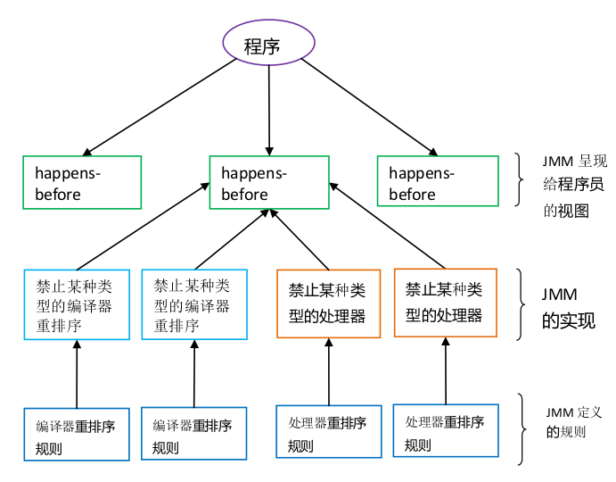

# Java内存模型

## 为什么要有Java内存模型? 它能够发挥什么作用?

JMM可以屏蔽各种硬件和操作系统的内存访问呢差异, 让Java程序在各种平台下都能达到一致的访问效果. 

JMM抽象了两种内存: 一种是线程私有的工作内存, 一种是共享的主内存. 主内存包括所有的实例字段, 静态字段, 数组等等. 方法的参数和局部变量则属于工作内存, 被线程私有. 另外每个对于主内存中变量的访问, 其实都是在自己工作内存中建立了一个拷贝. 两个线程同时操作一个变量, 这时需要JMM保证操作的正确性. 

内存模型的抽象可以用如下图来表示: 


### 指令重排序

在执行程序时, 为了提高性能, 编译器和处理器常常会对指令做重排序. 重排序有三类:
- 编译器优化的重排序. 编译器(javac)在不改变程序单线程程序语义的前提下, 可以重新安排语句的执行顺序. 
- 指令级并行的冲排序. 处理器采用了指令并行技术将多条语句重叠执行. 
- 内存系统的重排序. 由于处理器使用缓存和读/写缓冲区,这使得加载和存储操作看上去可能是在乱序执行。

源代码 -> 编译器重排序 -> 指令级并行重排序 -> 内存系统重排序 -> 最终执行.

### 工作内存和主内存之间的交互指令

虚拟机在实现时必须保证以下指令的原子性. 

- Lock：作用于主内存的变量。把一个变量标识为线程独占的状态
- Unlock：作用于主内存变量。把一个处于锁定状态的变量释放出来（只能释放自己的），解锁后的变量才可能被其他的线程锁定。
- Read：作用于主内存变量。把一个变量的值从主内存传输的线程的工作内存中，供随后的load动作使用。
- Load：作用于工作内存的变量。它把read操作从主内存中拿到的值放到工作内存的变量副本中。
- Use：作用与工作内存中的变量。把工作内存中的一个变量的值传递给执行引擎, 每当虚拟机遇到一个需要使用到变量的值的字节码指令时将会执行这个操作. 
- Assign：作用于工作内存的变量。它把一个从执行引擎接收到的值赋非工作内存的变量, 每当虚拟机遇到一个给变量赋值的字节码时执行这个操作. 
- Store：作用于工作内存的变量。把工作内存中的一个变量的值送到主内存，供随后write使用。
- Write：作用于主内存。把store操作从工作内存得到的变量值写入主内存的变量中。

### 指令交互的一些规则

- read和load；store和write必须成对出现。
- 不允许线程丢弃它最近的assign操作，就是说变量在工作内存中改变了之后必须同步到主内存。
- 不允许线程无原因的把数据从线程的工作内存同步到主内存（没有发生过assign操作）。
- 新的变量只能在主内存分配，不允许工作内存中直接使用一个未被初始化的变量。
- 一个变量同一时刻只能被同一个线程lock，相同的线程可以多次lock，但是也必须unlock相同次数。
- 对一个变量执行lock操作，将会清空工作内存中该变量的值，在用这个变量之前重新load或assign。
- 一个变量没有lock则不能unlock。
- 一个变量执行unlock操作之前, 必须先把此变量同步会主内存.

### volatile的可见性约定

- volatile保证此变量对所有线程的可见性.
- 禁止指令重排序. 

加了volatile的变量在汇编语言中赋值后多执行了一个"lock add **"操作, 这个操作相当于一个内存屏障(memory fence, 指重排序时不能把后面的指令重排到内存屏障之前的位置). 这个lock前缀的操作是使本cpu的cache写入内存, 这个写入动作还会触发别的cpu invalidate 其cache. 所以, 其它cpu在读一个volatile变量时都是从主内存获得其最新值. 

### 64位数据类型的特殊限制

JMM规定允许对long和double的读写划分成两次32位的操作来进行.但是几乎所有的厂商都把他们实现为原子性. 

使用场景:

- 运算结果不依赖于变量的当前值, 或能够确保只有单一的线程修改变量的值. 
- 不需要与其他状态变量共同参与不变约束.

### 原子性, 可见性和有序性

JMM提供的read, load, assing, store, write具有原子性. lock和unlock之间的同步块具备原子操作. 

volatile具备可见性. 
synchronized代码块在unlock之后会把变量之刷到主内存, 所以也具备可见性.
final变量一旦初始化完成, 其他县城技能看到final的值, 并且final的值不会发生改变. 

java提供as-if-serial的有序性, 在线程内所有的操作是有序的. volatile可以保证有序行, synchronized也可以保证有序性. 

### happens-before规则

- 程序顺序规则. 按照程序的顺序, 书写在前面的操作先于后边的操作. 有时这个规则会被打破:

```java
int i = 1;
int ii = 2;
int iii = i + ii;
```
因为i和ii之间没有内存可见性的问题, 所以ii可能先于i发生. 

- 监视器锁规则. 一个锁的unlock操作, 先于后边对这个锁的lock操作.
- volatile 变量规则. 对一个volatile变量的写操作先于对这个变量的读操作.
- 传递性. 
- 线程启动规则. 线程的start方法先于方法内的每一个操作.
- 线程终止规则. 线程中的所有操作先于线程的stop方法.
- 线程中断规则. interrupt方法先于线程检测到中断事件. 
- 对象终结规则. 对象的初始化完成先于finalize方法. 

happens before规则可以禁用一个或者多个指令重排序. 


