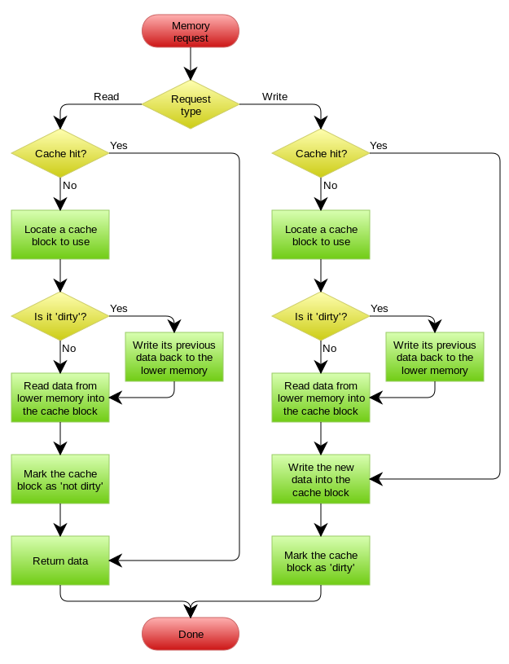

# Cache

## 加缓存是需要注意什么？

a)缓存穿透。是说访问一个缓存中没有的数据，但是这个数据数据库中也不存在。但是这种情况下如果是有人恶意攻击，那么会对数据库造成非常大的压力，因为缓存这时不会起到任何作用。
解决方案：

- 缓存空对象。当这个对象插入的时候把缓存更新掉。

- 维护一个可能的Cache Key，这个Cache Key可以自动和后端的数据库同步。

b)缓存并发
多个客户端同时访问一个没有在cache中的数据

- 预先预热数据
- 缓存加锁。如果多个用户访问的时候可以在获取数据的时候+锁。当数据拿回并成功set进cache后，解锁。

c)缓存防雪崩

- 确保缓存系统的高可用了

- 系统的限流措施。

d)要不要自动过期缓存
主动更新优于自动过期。因为高并发的系统，一个数据过期可能引发多个DB查询。

## 缓存的更新

- Cache Aside Pattern。先更新数据库，然后在disable cache。为什么不是写完之后reload数据，主要是怕并发的写操作导致脏数据。那么，是不是Cache Aside这个就不会有并发问题了？不是的，比如，一个是读操作，但是没有命中缓存，然后就到数据库中取数据，此时来了一个写操作，写完数据库后，让缓存失效，然后，之前的那个读操作再把老的数据放进去，所以，会造成脏数据。

但，这个case理论上会出现，不过，实际上出现的概率可能非常低，因为这个条件需要发生在读缓存时缓存失效，而且并发着有一个写操作。而实际上数据库的写操作会比读操作慢得多，而且还要锁表，而读操作必需在写操作前进入数据库操作，而又要晚于写操作更新缓存，所有的这些条件都具备的概率基本并不大。

- Read/Write Throngh。这个模式是cache代理了数据的全部操作。业务代码里边操作一个cache db。

Read Through。Read Through 套路就是在查询操作中更新缓存，也就是说，当缓存失效的时候（过期或LRU换出），Cache Aside是由调用方负责把数据加载入缓存，而Read Through则用缓存服务自己来加载，从而对应用方是透明的。
Write Through。Write Through 套路和Read Through相仿，不过是在更新数据时发生。当有数据更新的时候，如果没有命中缓存，直接更新数据库（这一步是为了数据一致性），然后返回。如果命中了缓存，则更新缓存，然后再由Cache自己更新数据库（这是一个同步操作）

- Write Back模式。更新是只更新缓存，然后缓存组建异步的把数据同步到DB中。Is-dirty判断是否从cache 写入到了持久层。

