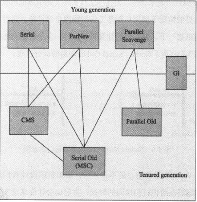

# JVM知识点合集

## 垃圾收集相关

### 垃圾回收时如何判断一个对象是垃圾，可以被回收。

- 引用计数。引用技术说的是垃圾回收器会记录对象被引用的次数。如果某个对象的计数为0,则这个对象可以被回收。引用计数算法比较简单，但是不能解决循环引用的问题。比如A引用B，B再引用A，那么基于这个算法两个对象永远不会被回收。

- 根搜索算法。根搜索算法是以GC Roots为起点进行搜索，当一个对象到GC Root没有任何引用的时候，那么这个对象可以被回收。

可以作为GC Roots的对象：虚拟机栈（栈帧中的本地变量表）中引用的对象；方法区中的类静态属性引用的对象；方法区中的常量引用的对象；本地方法栈中JNI（Native方法）引用的对象。

### Java中四种引用类型

- 强引用：只要引用还在，永远不会回收该对象。

- 软引用：只要内存够用软引用就可以正常被引用，但是当内存不够，要发生OOM之前，这些对象会被回收，如果内存还是不够，则引发OOM。通常一些基于内存的缓存会使用软引用。

- 弱引用：弱引用是比软引用更弱的一个引用。在下一次垃圾回收之前，弱引用的对象就会被回收。

- 虚引用：虚引用的唯一作用就是垃圾回收时收到一个通知。它不会影响垃圾回收。

### Java内存区域划分

- 程序计数器：程序计数器是一块比较小的内存空间，它的作用是当前线程所执行的字节码的行号指示器。在JVM里字节码解释器就是通过改变这个计数器来选取下一条需要执行的字节码指令，比如，分支，循环，跳转，异常处理等都是通过计数器来完成。

Java虚拟机的多线程是通过线程轮流切换并分配处理器执行时间的方式实现的，在任何一个时刻一个处理器只会执行一个线程中的指令。因此不同的线程要享有自己的程序计数器。

- 栈：栈是每个线程私有的空间。一个完整的方法调用，代表了一次入栈出栈过程。每个方法调用的时候都会创建一个栈帧，用于存储局部变量表（包括一些计算的中间变量），操作数栈，动态链接，方法返回地址(returnAddress)等这些信息。一个局部变量可以保存一个类型为 boolean、byte、char、short、float、reference和 returnAddress 的数据,两个局部变量可以保存一个类型为 long 和 double 的数据。

- 堆：堆空间的主要作用就是存放对象实例。堆是所有Java线程共享的区域，而且是垃圾回收器工作的主要区域。一般堆被分成了不同的区域：新生代（Eden，From Survior，to Survior），老年代。

- 方法区：方法区也是各个线程共享的区域，这个区域主要存储：加载的类信息，常量，静态变量，及时编译器编译后的代码等数据。这个区域也会进行GC，主要是回收常量池和对类型卸载, 不过通常回收的效果不佳。

- 运行时常量池：该区域是方法区的一部分。Class文件中除了类的版本，方法，字段接口等描述信息外，还有一项信息是常量池，用于存放编译期生成的各种字面量和符号引用，这部分内容将在类加载后放到运行时常量池。(每一个运行时常量池都分配在 Java 虚拟机的方法区之中,在类和接口被加载到虚拟机后,对应的运行时常量池就被创建出来。)

- 本地方法栈：本地方法栈类似于虚拟机栈，但是本地方法栈是为Native方法是使用的。

### 垃圾收集算法

- 标记清除：标记清除算法分为两个阶段，标记和清除。标记阶段是找到哪些对象需要被回收，清除阶段把这些对象回收掉。

这种算法有一个非常显著的弊端，清除完成后会造成内存碎片。导致分配一些大对象的时候引再次引发GC或者分配失败（OOM）。

- 标记整理：和标记清除算法类似，但是在清楚垃圾之前先把可用对象移向内存一段，然后清理掉边界以外的对象。

- 复制算法：复制算法把内存分成两块，每次只使用其中的一块。每次垃圾回收把存活的对象移动到另外一个内存空间。这样交替执行。

复制算法的弊端是，空间浪费严重，每次实际可用的内存只有总内存大小的一半。

- 分代收集：垃圾收集的过程中绝大多数新生对象都会被回收，只有少部分对象能够存活下来。而且年龄越大的对象越趋于稳定。基于这个经验发明了分代收集算法。整个内存空间会被分成：新生代和老年代。根据其不同的对象特性分别制定垃圾回收策略。新生代一般使用复制算法，老年代可以选择使用mark-sweep或者mark-compact。

HotSpot把新生代分成了三块（Eden，From Survivor，To Survivor）。Eden和（单个）Survivor的大小比例是8：1。整个区域可以利用90%的空间。当这个区域进行Minor GC的时候，Eden区存活的对象和当前使用的Survivor中存活的对象都会移动到另外一个Survivor中。这个过程中会有一些意外情况：Survivor空间可能不够用。遇到这种情况JVM中有一种空间担保机制，把这些对象都移动到老年代。

### 垃圾收集器

垃圾收集算法按照其执行的内存区域，可以分为年轻代垃圾收集器，包括：Serial，ParNew，Parallel Scavenge；可以在老年代工作的垃圾收集器：Serial Old，CMS，Parallel Old。G1收集器把内存分成了大小相等的好多块，因此不存在我们所理解意义上的Young，Old
区了。

Serial/Serial Old：

ParNew：

Parallel Scavenge：
Parallel是吞吐量优先的收集器，通过设置-XX:MaxGCPauseMillis最大GC停顿时间，-XX:GCTimeRatio GC时间和程序时间比率，来调整GC的时间。比如设置time ratio = 19, 则gc时间 5% = 1 / (1 + 19). 使用这个垃圾收集器不需要手动的设置新生代老年代的大小, Eden与Suvior的比例, 以及晋升老年代对象的年龄. JVM会收集性能信息动态的调整这些参数. 

Serial Old:

Parallel Old:

CMS:

垃圾收集线程数：（cpus + 3） / 4. 

CMS的缺点: 无法处理浮动垃圾, 就是在并发清除阶段产生的垃圾. 因为并发清除阶段程序仍在继续执行, 所以CMS一般等到空间使用68%时就会触发垃圾收集. 这个值可以通过: -XX:CMSInitiatingOccupancyFraction调整. 再一个缺点就是会产生碎片, 因此提供了-XX:CMSCompactAtFullGCCollection, 当执行一次Full GC时进行一次空间压缩. 还有一个参数是-XX:CMSFullGCsBeforeCompact, 表示多少次不压缩, 则执行一次压缩.

G1：

特点: 充分利用多核的优势；分代收集；空间整合, 采用标记整理算法；可预测的停顿.

G1收集器把堆内存分成了多个大小相等的空间Region, G1跟踪各个Region里边垃圾堆积的价值大小(回收空间的大小以及花费的时间的经验值), 并在后端维护一个列表, 每次根据允许的时间收集价值最大的Region.

G1执行的过程: 初始标记, 并发标记, 最终标记, 筛选回收.

### JVM的对象分配策略

- 对象优先分配在Eden区：
- 大对象分配到老年代：大对象指的是需要大量连续内存空间的对象。这种对象会直接分配的老年代。目的是为了减少在年轻代的大量的拷贝。JVM提供了一个参数设置大对象的阀值：-XX:PretenureSizeThreshold(这个参数只对Serial和Parnew两个收集器有效)
- 长期存活的对象进入老年代
- 空间分配担保：每次Minor GC的时候都会检查之前晋升到老年代的平均大小是否大于当前老年代当前剩余空间，如果大于则执行一次Full GC。如果小于则查看HandlePromotionFailure设置是否允许空间担保失败，如果允许则只进行Minor GC，如果不允许则执行一次Full GC。
- 动态年龄判断：如果Survivor中相同年龄的对象达到了空间的一半及以上，那么>=该对象年龄的对象提前晋升到老年代。

### JVM启动参数以及调优

a)垃圾算法选择：
8G以下的堆还是使用CMS比较稳妥。
-XX:+UseConcMarkSweepGC：打开CMS垃圾收集器，打开此选项之后，年轻代会使用ParNew收集器。

-XX:CMSInitiatingOccupancyFraction=75：空间使用率到达多少的时候开始执行GC。

-XX:+UseCMSInitiatingOccupancyOnly：打开这个参数是让JVM总按照75%这个指标进行GC。

-XX:MaxTenuringThreshold=2：设置新对象经过多少轮的GC可晋升老年代。这个参数越大新对象就要经过多轮的复制，也比较耗资源，如果能够大概预估出系统的对象特性，可以设置。Young GC是最大的应用停顿来源，而新生代里GC后存活对象的多少又直接影响停顿的时间，所以如果清楚Young GC的执行频率和应用里大部分临时对象的最长生命周期，可以把它设的更短一点，让其实不是临时对象的新生代长期对象赶紧晋升到年老代，别呆着。

用-XX:+PrintTenuringDistribution观察下，如果后面几代都差不多，就可以设小，比如JMeter里是2。而我们的两个系统里一个设了2，一个设了6。

-XX:+ExplicitGCInvokesConcurrent， 但不要-XX:+DisableExplicitGC：不要手动禁掉System.gc()，-XX+ExplicitGCInvokesConcurrent 则在full gc时，并不全程停顿，依然只在ygc和两个remark阶段停顿，详见JVM源码分析之SystemGC完全解读（http://lovestblog.cn/blog/2015/05/07/system-gc/）。

-XX:ParallelGCThread：设置Parallel 阶段的并发线程数。如果CPU的线程数小于8,则默认值是线程数，如果大于8则按一下以下公式计算：ParallelGCThreads＝8+( Processor - 8 ) ( 5/8 )。

-XX:ConcGCThreads：设置并发收集线程数，ConcGCThreads = (ParallelGCThreads + 3)/4。

b)内存大小：
-Xmx, -Xms：堆内存大小，2～4G均可，再大了注意GC时间。

-Xmn or -XX:NewSize and -XX:MaxNewSize or -XX:NewRatio： JDK默认新生代占堆大小的1/3。一般新生代越小则GC次数越多，越大则越少，但是GC停顿的事件就会越长。
-XX:MetaspaceSize(PermSize)=128m -XX:MaxMetaspaceSize(MaxPermSize)=512m（JDK8），JDK8的永生代几乎可用完机器的所有内存，同样设一个128M的初始值，512M的最大值保护一下。

-XX:SurvivorRatio：Eden 和 Survior的比例。

-XX:Xss：设置线程分配栈的大小。

-XX:MaxDirectMemorySize，堆外内存/直接内存的大小，默认为Heap    区总内存减去一个Survivor区的大小（默认的堆可用最大空间）。

c)打印GC日志
-Xloggc:/dev/shm/gc-myapplication.log // 到后来，又发现如果遇上高IO的情况，如果GC的时候，操作系统正在flush pageCache 到磁盘，也可能导致GC log文件被锁住，从而让GC结束不了。所以把它指向了/dev/shm 这种内存中文件系统，避免这种停顿，详见

-XX:+PrintGCDateStamps 
-XX:+PrintGCDetails

-XX:+UseGCLogFileRotation -XX:NumberOfGCLogFiles=10 -XX:GCLogFileSize=1M：设置GC日志切割。

-XX:ErrorFile=${MYLOGDIR}/hs_err_%p.log：jvm crash的时候记录下状态信息。

-XX:+HeapDumpOnOutOfMemoryError -XX:HeapDumpPath=${LOGDIR}/  ： 出发OOM之前，输出Heap Dump到文件。