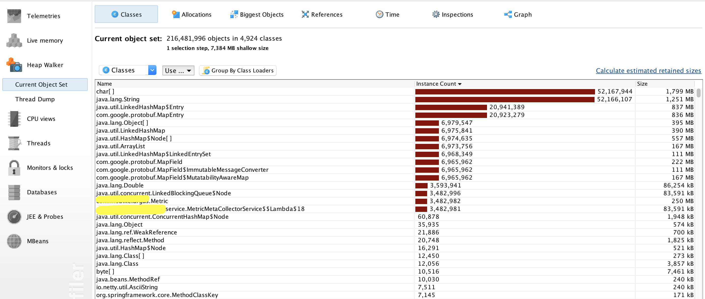

## 背景

最近一直在公司做业务监控系统。大致的实现方式是这样的：业务端定时上报业务指标到后端服务，后端服务拿到数据后丢到Kafka。然后又写了Kafka Consumer把数据转储到InfluxDB。数据图表在Grafana显示。

## 问题

一直跑的好好的系统，最近经常收到Grafana发出的No Data报警（Grafana可以配置报警，当持续多长时间没有数据则触发报警）。很明显是我们的数据链中某一环出了问题。

首先看项目的错误日志。登录sentry，发现了OutOfMemory错误：

```java
org.springframework.web.util.NestedServletException: Handler dispatch failed; nested exception is java.lang.OutOfMemoryError: Java heap space
    at org.springframework.web.servlet.DispatcherServlet.doDispatch(DispatcherServlet.java:982)
    at org.springframework.web.servlet.DispatcherServlet.doService(DispatcherServlet.java:901)
    at org.springframework.web.servlet.FrameworkServlet.processRequest(FrameworkServlet.java:970)
    at org.springframework.web.servlet.FrameworkServlet.doGet(FrameworkServlet.java:861)
    at javax.servlet.http.HttpServlet.doHead(HttpServlet.java:245)
    at javax.servlet.http.HttpServlet.service(HttpServlet.java:658)
    at org.springframework.web.servlet.FrameworkServlet.service(FrameworkServlet.java:846)
    at javax.servlet.http.HttpServlet.service(HttpServlet.java:742)
    at org.apache.catalina.core.ApplicationFilterChain.internalDoFilter(ApplicationFilterChain.java:231)
    at org.apache.catalina.core.ApplicationFilterChain.doFilter(ApplicationFilterChain.java:166)
    at org.apache.catalina.core.ApplicationDispatcher.invoke(ApplicationDispatcher.java:728)
    at org.apache.catalina.core.ApplicationDispatcher.processRequest(ApplicationDispatcher.java:469)
    at org.apache.catalina.core.ApplicationDispatcher.doForward(ApplicationDispatcher.java:392)
    at org.apache.catalina.core.ApplicationDispatcher.forward(ApplicationDispatcher.java:311)
    at org.apache.catalina.core.StandardHostValve.custom(StandardHostValve.java:395)
    at org.apache.catalina.core.StandardHostValve.status(StandardHostValve.java:254)
    at org.apache.catalina.core.StandardHostValve.invoke(StandardHostValve.java:177)
    at org.apache.catalina.valves.ErrorReportValve.invoke(ErrorReportValve.java:80)
    at org.apache.catalina.core.StandardEngineValve.invoke(StandardEngineValve.java:87)
    at org.apache.catalina.connector.CoyoteAdapter.service(CoyoteAdapter.java:342)
    at org.apache.coyote.http11.Http11Processor.service(Http11Processor.java:799)
    at org.apache.coyote.AbstractProcessorLight.process(AbstractProcessorLight.java:66)
    at org.apache.coyote.AbstractProtocol$ConnectionHandler.process(AbstractProtocol.java:868)
    at org.apache.tomcat.util.net.NioEndpoint$SocketProcessor.doRun(NioEndpoint.java:1455)
    at org.apache.tomcat.util.net.SocketProcessorBase.run(SocketProcessorBase.java:49)
    at java.util.concurrent.ThreadPoolExecutor.runWorker(ThreadPoolExecutor.java:1149)
    at java.util.concurrent.ThreadPoolExecutor$Worker.run(ThreadPoolExecutor.java:624)
    at org.apache.tomcat.util.threads.TaskThread$WrappingRunnable.run(TaskThread.java:61)
    at java.lang.Thread.run(Thread.java:748)
```

JVM内存跑光了。当时没多想，内存从4G调到了8G，以为这样就没事儿了（其实事情没这么简单）。因为看到OutOfMemory时，下意识想到两个原因：1. 最近所有的核心业务都介入了监控系统，系统的流量大概涨了5倍左右；2. Consumer和Server两个系统耦合在一起，导致内存消耗严重。

好景不长，没过两天问题又出现了。现象和错误都还是一样的。其实这会应该登录服务器看看系统和JVM的情况。但是心里一直坚信自己写的程序没问题（打脸）。服务端程序和Consumer都简单做过压力测试，承载现在的量应该是没有问题的。得尽快把Consumer和Server拆开，分开部署。这样花了半天的时间把两个项目进行拆分，独立部署。Consumer给了4G内存，Server给了8G内存。

果然过了两天，数据又断了。这会只能硬着头皮去查问题的真相了。

先登上服务器，看了下最可能出问题的Consumer，CPU占用很少，10%以下，内存保持在不到3G。没有什么异常的特征。

然后又看了下Server，瞬间打脸，CPU疯狂的飙到了100%，内存已经占用十几G了。伴随着Sentry上的OutOfMemory，这基本可以确诊内存泄漏了。找到GC log看了下GC情况：Allocation Error。内存泄漏实锤。

## 排查

先例行来个heap dump吧：`jmap -dump:format=b,file=heapDump.hprof 0`。因为docker启动的实例，所以jvm进程号为0，如果实体机上跑了多个Java程序，可以使用`jps -l`查找响应的Java进程。

漫长的等待，终于搞定了等到jmap执行完成。dump出来的文件有11G。先压缩吧，这么大的文件得传到什么时候啊。压缩之后还剩5个多G。下载到本地进行内存分析。

由于文件体积巨大，用VisualVM和jhat这两个工具根本没法打开文件。于是换了JProfiler，终于看到了当前堆的占用情况：



刚看到这个图，其实也有点蒙圈。看看占用内存最大的两个类：char[]，java.lang.String，知道问题肯定是它俩造成的，但是没有办法和程序关联起来。

再接着看下去 **.**.**.Metric，**.**.**.data.serbice.MetricMetaCollectorService$$Lamabda$18，这是我写的业务代码。MetricMetaCollectorService是最近刚加载Server中的一个类，它的主要功能是抽取客户端上传上来的元数据信息，检查是否已经在MySQL中存在，没有则写入一份。

这时隐约发现一点头绪了，是这个Service导致的问题。但是具体犯罪过程还是不明晰。接着再看堆分析，这时发现了另外一个疑点：java.util.concurrent.LinkedBlockingQueue$Node。这个类我没在业务中用过，它的有几乎和Metric数量相当的数量。BlockingQueue难道和线程池有关系？因为印象中Executors在创建线程池时，好几个场景都是默认给定LinkedBlockingQueue为工作队列。

和MetricMetaCollectorService的异步执行有关系吗？因为为了不影响整个server的吞吐量，这块做了异步化。先分析下这块的逻辑：

```java
    @Bean(name = "internalExecutor")
    public ThreadPoolTaskExecutor getInternalExecutor() {
        ThreadPoolTaskExecutor executor = new ThreadPoolTaskExecutor();
        executor.setCorePoolSize(2);
        executor.setMaxPoolSize(4);
        return executor;
    }
```

线程池使用的是Spring封装的，初始化制定了期望了核心线程数和最大线程数。来找一下它底层用的是哪种work queue。打开ThreadPoolTaskExecutor文件，找到initializeExecutor方法：

```java
    protected ExecutorService initializeExecutor(
			ThreadFactory threadFactory, RejectedExecutionHandler rejectedExecutionHandler) {

		BlockingQueue<Runnable> queue = createQueue(this.queueCapacity);

		ThreadPoolExecutor executor;
		if (this.taskDecorator != null) {
			executor = new ThreadPoolExecutor(
					this.corePoolSize, this.maxPoolSize, this.keepAliveSeconds, TimeUnit.SECONDS,
					queue, threadFactory, rejectedExecutionHandler) {
				@Override
				public void execute(Runnable command) {
					super.execute(taskDecorator.decorate(command));
				}
			};
		}
		else {
			executor = new ThreadPoolExecutor(
					this.corePoolSize, this.maxPoolSize, this.keepAliveSeconds, TimeUnit.SECONDS,
					queue, threadFactory, rejectedExecutionHandler);

		}
	}
```

work queue是在领外的一个方法createQueue中实现的：
```java
	protected BlockingQueue<Runnable> createQueue(int queueCapacity) {
		if (queueCapacity > 0) {
			return new LinkedBlockingQueue<Runnable>(queueCapacity);
		}
		else {
			return new SynchronousQueue<Runnable>();
		}
	}
```
queueCapacity的默认值是`Integer.MAX_VALUE`，所以可以确定internalExecutor确实用到了LinkedBlockingQueue。到这一步已经完全定位问题了：MetricMetaCollectorService异步化，导致了work queue任务大量堆积占用了过多的内存。

后续把相应的逻辑删除后，服务恢复正常迄今再未出现过断点。

又一个疑问，为什么之前跑的好好地一直没问题？因为原来数据量比较少，线程池能够忙活过来，即便有一些任务堆积也可以快速的消费完成（抑或已经有了内存问题只是增长的速度非常慢）。但是所有的核心系统都介入之后，数据量猛增，工作队列持续积压，导致最后内存耗尽。

## 反思

1. 正确的使用线程池。估算工作量，给出合理的core和maximum线程数。除了这两个还有两个容易被忽略的参数，工作队列和abort policy。我的场景是后边两个原因导致，使用了无界队列。如果当时仔细考虑下，选择使用：有界队列+CallerRunsPolicy便不会有这番折腾。

2. 系统出问题时，不要有侥幸心理，想着重启能够解决。及时查看系统日志大概定位问题，不要破坏犯罪现场和第一手证据。如果是内存问题，先heap dump把当前堆的使用情况导出来。如果是cpu问题，可以先通过操作系统工具定位下具体是哪个线程消耗cpu较多，然后再结合thread dump文件排查问题。

3. 善于使用JVM提供的一些功能。打印垃圾收集日志，方便分析垃圾收集情况；JVM进程crash时把heap dump出来，预防进程突然crash手上没有东西可分析定位问题。

4. 项目运行环境光有一个Jre还不够，安上jmap，jstat等这些JDK自带的工具，预防出了问题找不到趁手的工具使用。


延伸：
jvm配置
各个工具的使用方法
